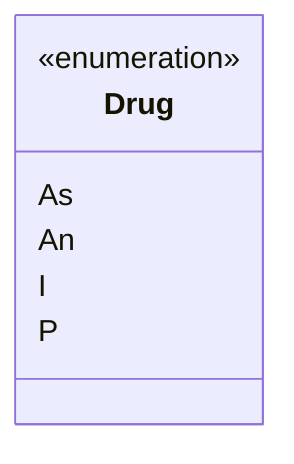
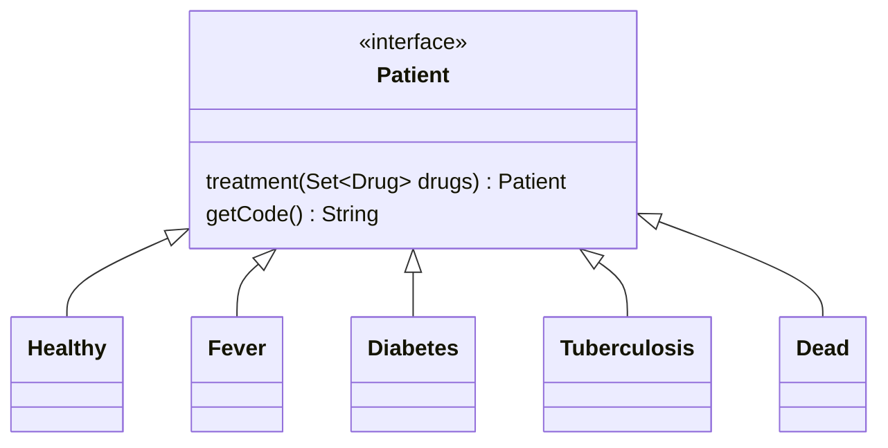
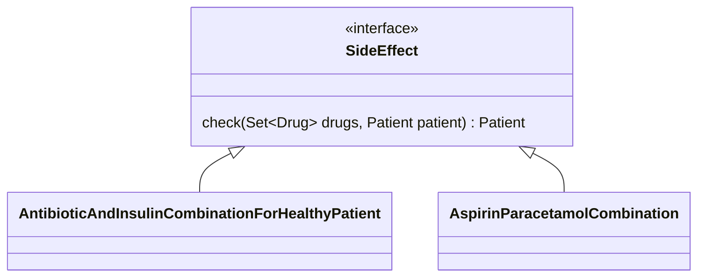
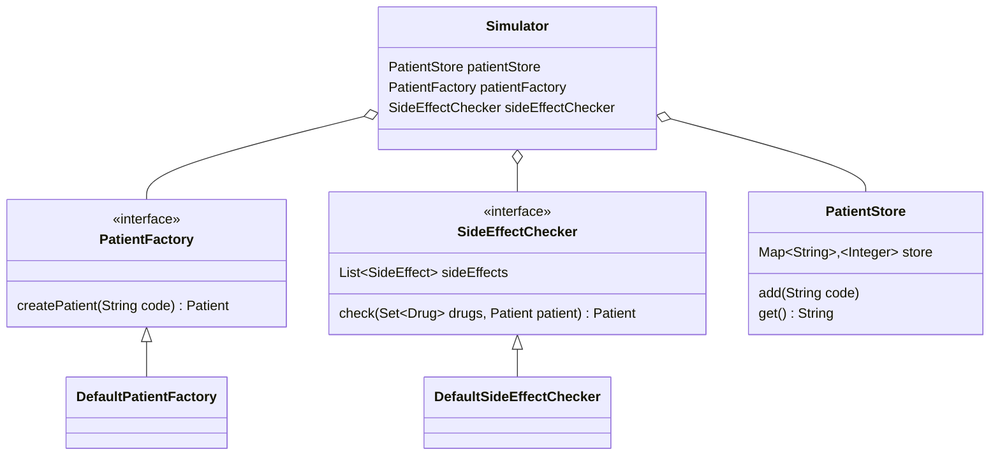

# Hospital Simulator

### Tools used
1. Java 17
2. Spring for dependency injection
3. Gradle as build tool

### Prerequisite
Install Java 17 which will be needed to build the jar. 

### How to run?
First build the application with and then run the jar as shown below.
```aidl
./gradlew build
java -jar build/libs/hospital-simulator-1.0-SNAPSHOT.jar T,F,D An,I
```

### Low level design

```Drug``` is considered as an enum. When a new drug needs to be added simply can be added as a new enum in Drug.

```Patient``` is an interface having two methods ```treatment``` which takes set of drugs and returns the new state of the Patient. It also has a ```getCode``` method which gives the code of the patient example  F, H, D, T, X etc. All the different states of patient implements Patient interface. If new states needs to be added then a new implementation class of patient can be created.

```SideEffect``` is an interface which has one abstract method ```check``` which takes set of drugs and patient and return new state of the patient. Different class can be implemented to SideEffect based upon different combination of drugs that can result in a side effect.


```PatientFactory``` creates patient based on the code.

```SideEffectChecker``` checks side effects for a patient based on the given set of drugs and returns new state of the patient.
It contains instances of all class that implements this and loops on all of them check if it has any side effect.

```PatientStore``` stores the result with count of different states of patient.


```Simulator``` does the following tasks
1. Reads the arguments and creates lists of patient codes and list of drugs.
2. Creates a list of Patient using patient factory based on codes provided in the arguments.
3. Loops on each patient to simulate the treatment with drugs and then checks the side effects.
4. Add the result in store using patient store.
5. At end patient store returns the overall results which is printed on the console.

